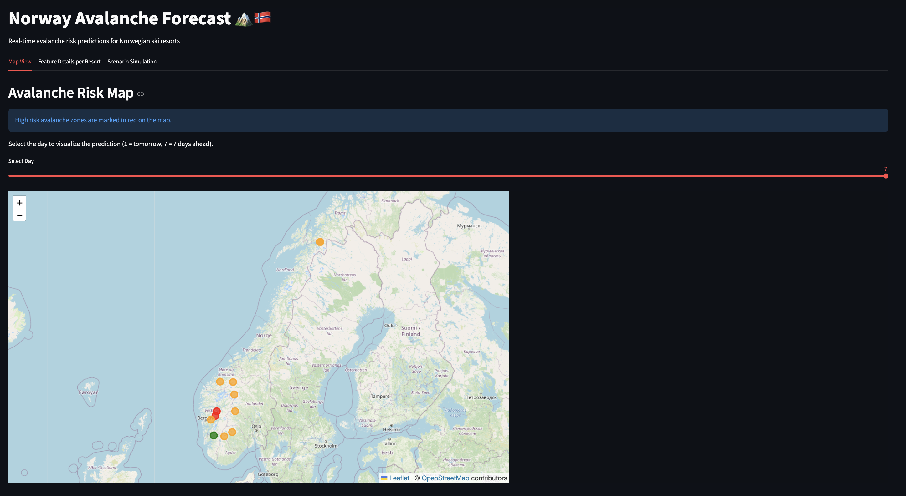
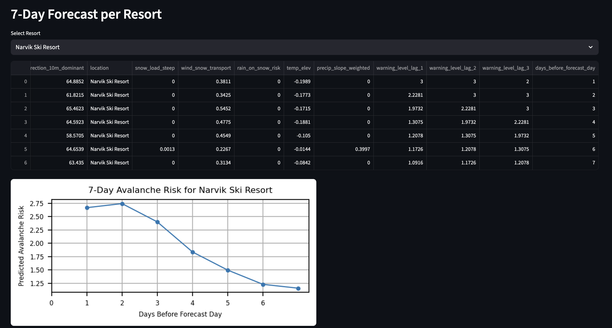

# ID2223-Project: Norway Avalanche Risk Forecast 🏔️🇳🇴
This project implements a scalable machine learning pipeline to predict avalanche risks for major ski resorts in Norway. It utilizes Hopsworks as a Feature Store and Model Registry, XGBoost for prediction models, and Streamlit for an interactive user interface.

## Project Overview
The goal of this system is to predict the avalanche danger level (0-4 scale: 0-Not rated; 1-Low avalanche danger; 2-Moderate avalanche danger; 3-Considerable avalanche danger; 4-High avalanche danger) based on weather forecasts, historical warnings, and static terrain analysis. 

### Key Components
* **Feature Store:** Hopsworks manages both historical and daily feature data.  
* **Model:** An individual XGBoost classifier or regressor is trained for each resort to capture local microclimate patterns.  
* **Interface:** A Streamlit app that allows users to simulate weather conditions and receive immediate risk predictions using the registered models.


## Streamlit UI
https://ahuaqmcwy9diaouzzwthns.streamlit.app/

## Technologies Used
This project uses a contemporary MLOps stack to manage geospatial data, perform feature engineering, and deploy models:
 * **Core & MLOps:**
      * **Python 3.8+:** Primary programming language.
      * **[Hopsworks](https://www.hopsworks.ai/):** Serverless Feature Store and Model Registry used to store historical weather/terrain features and manage model versions.
      * **GitHub Actions:** (Intended) for scheduling the daily feature pipeline execution.

  * **Machine Learning & Data Processing:**
      * **XGBoost:** Used for training the avalanche prediction models.
      * **Scikit-Learn:** Used for label encoding, performance metrics (Accuracy, MAE), and time-series data splitting.
      * **Pandas:** For data manipulation and lag feature generation.

  * **Geospatial & APIs:**
      * **Open-Meteo API:** Source for historical and forecast weather data (temperature, wind, precipitation).
      * **Rasterio & Shapely:** Used to process Digital Terrain Models (DTM), computing slope, elevation, and aspect for specific resort coordinates.
      * **PyProj:** Handles coordinate reference system transformations.

  * **Visualization & UI:**
      * **Streamlit:** Framework for the interactive web dashboard.
      * **Folium:** Used for rendering the interactive map of Norway with color-coded risk markers.
      * **Matplotlib:** Used for generating forecast trend graphs in the UI.


## Architecture & Pipelines
The project consists of four main stages:

### 1\. Data Ingestion & Backfill (`feature_backfill.ipynb`)
This notebook is run daily to initialize the system by processing historical data (from \~2020 to present):
  * **Avalanche Warnings:** Fetches historical danger levels for specific regions.
  * **Weather Data:** Retrieves daily weather metrics (temp, wind, precip) via Open-Meteo.
  * **Terrain Analysis:** Processes Digital Terrain Models (DTM/GeoTIFFs) to calculate slope, elevation, and steepness fractions for every resort.
  * **Feature Groups:** Data is uploaded to the Hopsworks Feature Store as `avalanche_warning`, `weather_terrain_sensor`, and `terrain_data`.

### 2\. Daily Feature Pipeline (`daily_feature_pipeline.ipynb`)
Designed to run on a schedule:
  * Fetches the forecast for the current day and the avalanche warning for the current day.
  * Computes *Lag Features* (Warning levels for the previous 1, 2, and 3 days).
  * Updates the Feature Store.

### 3\. Model Training (`model_training.ipynb`)R
 * **Feature View**: Combines weather, terrain, and warning datasets into a unified feature view.
 * **Training Strategy**: Loops through each resort defined in locations.py and trains a dedicated XGBoost model tailored to that location.
 * **Hyperparameter Tuning**: Applies RandomizedSearchCV with TimeSeriesSplit to tune parameters such as n_estimators, max_depth, and learning_rate.
 * **Model Registry**: Stores the best-performing model for each resort in the Hopsworks Model Registry.

**Performance:** All trained models demonstrate high reliability, consistently achieving an accuracy score higher than 90% and a Mean Squared Error (MSE) lower than 0.06 across all monitored locations.

**Evaluation:** For a more detailed view, we also report the per-resort confusion matrices resulting from training the XGBoost Classifier and Regressor. This helped us assess not only overall accuracy, but also the distribution and magnitude of prediction errors across the ordinal rating scale, revealing whether misclassifications tend to occur between nearby classes. The image below is an example:


Overall, both approaches make good predictors, where wrong predictions do not significantly deviate from the true values.


### 4\. Batch Inference (`model_inference.ipynb`)
This notebook handles automated daily predictions:
* **Retrieval:** Loads the batch inference data from the Feature View.
* **Model Loading:** Downloads the specific model for every resort from the registry.
* **Prediction:** Generates predictions for the next 7 days.
* **Storage:** Saves the predictions back to Hopsworks as feature groups (e.g., `aq_predictions_narvik_ski_resort`) for downstream consumption.

### System Architecture
The following diagram illustrates the system architecture in detail:


##  Feature Engineering
The project creates interaction features to capture key physical processes behind avalanche formation:
* **`snow_load_steep`**: Combines total snowfall with the proportion of terrain steeper than 30°.  
* **`wind_snow_transport`**: Approximates wind-driven snow transport using wind speed and direction relative to local terrain.  
* **`rain_on_snow_risk`**: Flags periods when rainfall occurs on top of an existing snowpack.  
* **`precip_slope_weighted`**: Weights precipitation by the average slope of the resort area.  
* **`temp_elev`**: Adjusts temperature values based on elevation differences.

## The Streamlit App (`app.py`)
The application serves as the frontend for the project.

### Features:
1. **Map View:**
This tab provides a geospatial overview of avalanche risks, including a Folium map that displays markers for all supported ski resorts in Norway. It provides a 7-Day Forecast Slider that allows users to view predictions for the upcoming week (Day 1 represents tomorrow, up to Day 7). Also, the map includes risk indicators which are color-coded based on the predicted warning level (Green for low, Orange for medium, Red for high risk).


2. **Feature Details per Resort:** This tab allows an overview of the data driving the predictions:
* **Resort Selection:** Users can select a specific resort
* **Detailed Forecasts:** Displays a dataframe containing the predictions along with the specific weather (wind, temperature, precipitation) and terrain conditions for the next 7 days.
* **Risk Graphics:** A line graph visualizes the predicted avalanche risk trend over the 7-day period, allowing users to quickly identify upcoming high-risk days.



## 🛠️ Setup & Installation

### Prerequisites
* Python 3.8+
* A Hopsworks API Key.
* Digital Terrain Model (DTM) files (if running the backfill).

### 1\. Install Dependencies
```bash
pip install -r requirements.txt
```

### 2\. Environment Variables
Create a `.env` file in the root directory:
```bash
HOPSWORKS_API_KEY=your_api_key_here
```

### 3\. Running the Pipeline
1.  **Backfill:** Run `feature_backfill.ipynb` to populate the feature store.
2.  **Daily Update:** Run `daily_feature_pipeline.ipynb` to add today's data.
3.  **Train Models:** Run `model_training.ipynb` to train and register the models.
4.  **Batch Predict:** Run `model_inference.ipynb` to generate daily forecasts.

### 4\. Running the App
```bash
streamlit run app.py
```
