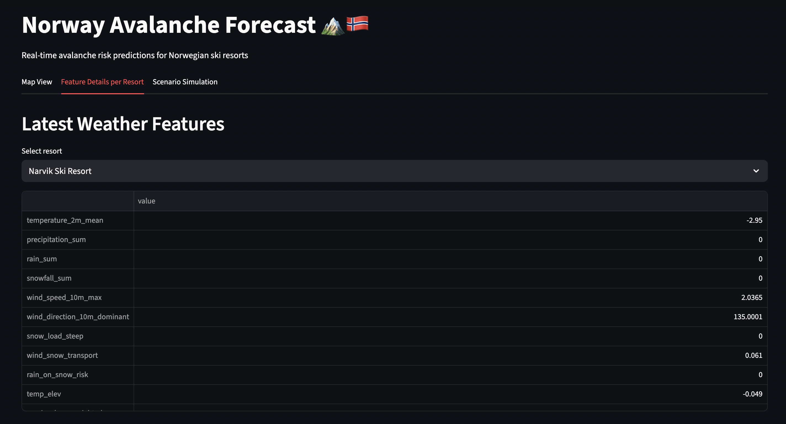

# ID2223-Project: Norway Avalanche Risk Forecast 🏔️🇳🇴
This project implements a scalable machine learning pipeline to predict real-time avalanche risks for major ski resorts in Norway. It utilizes **Hopsworks** as a Feature Store and Model Registry, **XGBoost** for prediction models, and **Streamlit** for an interactive user interface.

## Project Overview
The goal of this system is to predict the avalanche danger level (0-5 scale: 0-Not assessed; 1-Small; 2-Moderate; 3-Significant; 4-Large; 5-Very large) based on weather forecasts, historical warnings, and static terrain analysis. 

### Key Components
* **Feature Store:** Hopsworks manages both historical and daily feature data.  
* **Model:** An individual XGBoost classifier or regressor is trained for **each** resort to capture local microclimate patterns.  
* **Interface:** A Streamlit application offers interactive map visualizations and a “Scenario Simulation” feature.

## Architecture & Pipelines
The project consists of three main stages:

### 1\. Data Ingestion & Backfill (`feature_backfill.ipynb`)
This notebook initializes the system by processing historical data (from \~2020 to present):
  * **Avalanche Warnings:** Fetches historical danger levels for specific regions.
  * **Weather Data:** Retrieves daily weather metrics (temp, wind, precip) via Open-Meteo.
  * **Terrain Analysis:** Processes Digital Terrain Models (DTM/GeoTIFFs) to calculate slope, elevation, and steepness fractions for every resort.
  * **Feature Groups:** Data is uploaded to the Hopsworks Feature Store as `avalanche_warning`, `weather_terrain_sensor`, and `terrain_data`.
### 2\. Daily Feature Pipeline (`daily_feature_pipeline.ipynb`)
Designed to run on a schedule:
  * Fetches the forecast for the current day and the avalanche warning for the current day.
  * Computes *Lag Features* (Warning levels for the previous 1, 2, and 3 days).
  * Updates the Feature Store.

### 3\. Model Training (`model_training.ipynb`)
* ** Feature View**: Combines weather, terrain, and warning datasets into a unified feature view.
* **Training Strategy**: Loops through each resort defined in locations.py and trains a dedicated XGBoost model tailored to that location.
* **Hyperparameter Tuning**: Applies RandomizedSearchCV with TimeSeriesSplit to tune parameters such as n_estimators, max_depth, and learning_rate.
* **Model Registry**: Stores the best-performing model for each resort in the Hopsworks Model Registry.

##  Feature Engineering
The project creates interaction features to capture key physical processes behind avalanche formation:
* **`snow_load_steep`**: Combines total snowfall with the proportion of terrain steeper than 30°.  
* **`wind_snow_transport`**: Approximates wind-driven snow transport using wind speed and direction relative to local terrain.  
* **`rain_on_snow_risk`**: Flags periods when rainfall occurs on top of an existing snowpack.  
* **`precip_slope_weighted`**: Weights precipitation by the average slope of the resort area.  
* **`temp_elev`**: Adjusts temperature values based on elevation differences.

## The Streamlit App (`app.py`)
The application serves as the frontend for the project.

### Features:
1. **Map View:** An interactive Folium map displaying Norwegian ski resorts, with markers color‑coded (Green/Orange/Red) according to the predicted avalanche risk.


2. **Feature Details:** A panel showing the specific weather and terrain features that drive the model’s prediction for the selected resort.  


3. **Scenario Simulation:** A tool where the user can adjust feature sliders (e.g., `snowfall_sum`, `wind_speed`) and instantly observe how the predicted avalanche risk changes for that resort. This tool can be used to predict multiple scenarios in case weather conditions variate.


## 🛠️ Setup & Installation

### 1\. Install Dependencies
```bash
pip install -r requirements.txt
```

### 2\. Environment Variables
Create a `.env` file in the root directory:
```bash
HOPSWORKS_API_KEY=your_api_key_here
```

### 3\. Running the Pipeline
1.  **Backfill:** Run `feature_backfill.ipynb` to populate the feature store.
2.  **Daily Update:** Run `daily_feature_pipeline.ipynb` to add today's data.
3.  **Train Models:** Run `model_training.ipynb` to train and register the models.

### 4\. Running the App
```bash
streamlit run app.py
```
